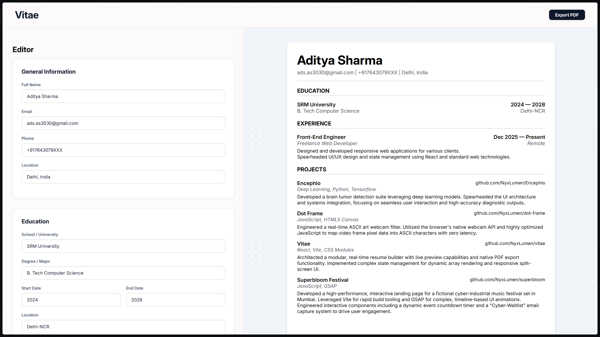

# Vitae

A high-fidelity, client-side resume builder engineered for speed and precision. No accounts, no paywalls, just a clean interface to generate a professional, ATS-friendly PDF resume in real-time.

## Features

- **Live Preview Engine:** Watch your data render instantly on a structured A4 drafting canvas.
- **Zero-Friction Export:** Pixel-perfect PDF generation utilizing native browser print logic.
- **Persistent Storage:** State is bound to local storage to ensure zero data loss between sessions.
- **Responsive Workspace:** Fluid flexbox architecture providing a seamless editing experience on both desktop and mobile.
- **Enterprise UI:** A highly structured, solid-color SaaS interface built entirely with pure CSS Modules.

## Tech Stack

- **Core:** React + Vite
- **Styling:** CSS Modules
- **State Management:** React Hooks + Local Storage
- **Deployment:** Vercel
